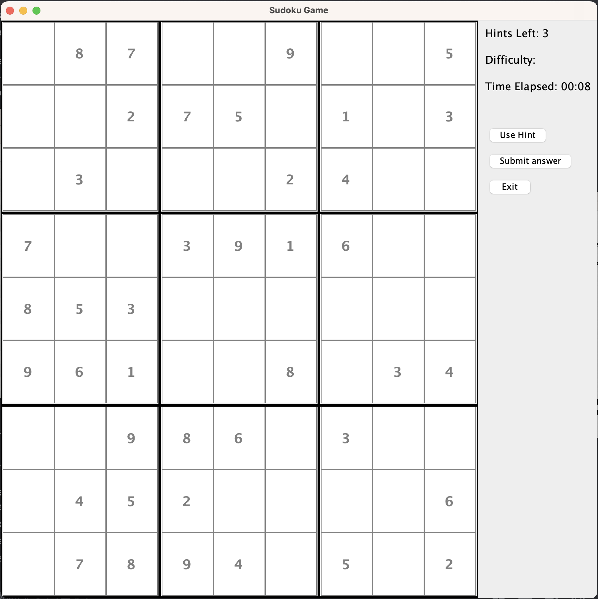
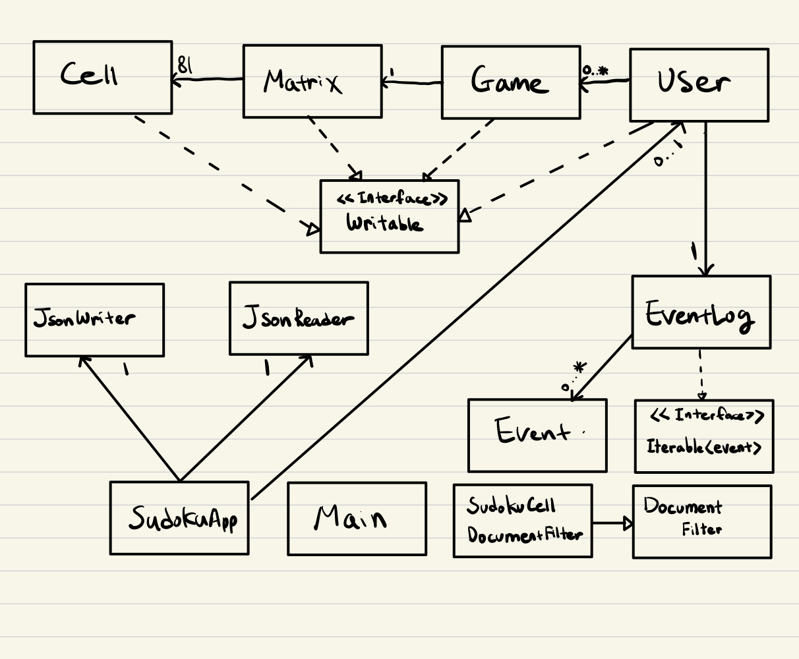

# About The Project

I decided to make a simple, interactive Sudoku game that allows players to generate new puzzles, solve them, and track their performance. Users can select a difficulty level, request hints, and save/load their game progress at any time. This project was developed with a focus on 2D array manipulation and class associations, making it an excellent exploration of object‐oriented programming (OOP) concepts.

The project was built with Java Swing.

---

## Table of Contents

1. [Features](#features)  
2. [Instructions for End Users](#instructions-for-end-users)  
3. [Class Structure (Phase 4: Task 3)](#class-structure-phase-4-task-3)  
4. [Contact](#contact)

---

## Features

- **Sudoku Puzzle Generation**  
  Generate a new Sudoku game with varying difficulty levels.

- **Interactive Game Board**  
  Users can fill in cells, add notes for potential answers, and request hints.

- **Performance Tracking**  
  Tracks the time taken to solve each puzzle, providing an added layer of engagement.

- **Saving and Loading Games**  
  Allows users to save progress at any point and load previously saved games.

- **Solution Validation**  
  Users can check their solutions once they believe they have completed a puzzle.

- **Logging**   
Logs all major events during the program's execution.

---

## Instructions for End Users

1. **Launch the Application**   
    - Create a new user or load an existing user from the database.

2. **Generate / Load a Game**  
   - Use **Create New Game** to generate a fresh puzzle.  
   - Use **Load Game** to continue playing a saved puzzle.

3. **Interact with the Sudoku Board**  
   - The Sudoku board is displayed in the main menu/game screen.  
   - Enter numbers, and request hints if you are stuck.

4. **Save Progress**  
   - Click **Save** in the main options menu. This saves all user data (including game history).

5. **Load Progress**  
   - Click **Load User** in the main options menu. This loads saved user information and game states.

6. **Check and Track**  
   - Once the puzzle is completed, the application will verify your solution.  
   - A timer tracks how long it takes you to solve each puzzle.

---

## Class Structure & UML Diagram

- **User Class**  
    - Has a field of `Game` (multiplicity `0..*`).  
    - Has a field of `EventLog` (multiplicity `1`).  
    - Implements `Writable` interface.

- **Game Class**  
    - Has a field of `Matrix` (multiplicity `1`).  
    - Implements `Writable` interface.

- **Matrix Class**  
    - Has a field of `Cell` (multiplicity `81`). (A 9×9 grid for Sudoku cells)  
    - Implements `Writable` interface.

- **Cell Class**  
    - Represents an individual Sudoku cell.  
    - Implements `Writable` interface.

- **EventLog Class**  
    - Implements `Iterable`.  
    - Has a field of `Event` (multiplicity `0..*`).

- **Event Class**  
    - Represents a single event in the `EventLog`.

- **SudokuApp Class**  
    - Has a field of `JsonWriter` and `JsonReader` (both with multiplicity `1`).

- **SudokuCellDocumentFilter Class**  
    - Extends `DocumentFilter` for restricting input in Sudoku cells (e.g., numeric input only).

UML Design Diagram:

## Contact

**Author:** Ryan Park  
**Email:** [parkryan0128@gmail.com](mailto:parkryan0128@gmail.com)  
**LinkedIn:** [linkedin.com/in/rp0128](https://linkedin.com/in/rp0128)  
**GitHub:** [github.com/RyanPark0128](https://github.com/RyanPark0128)